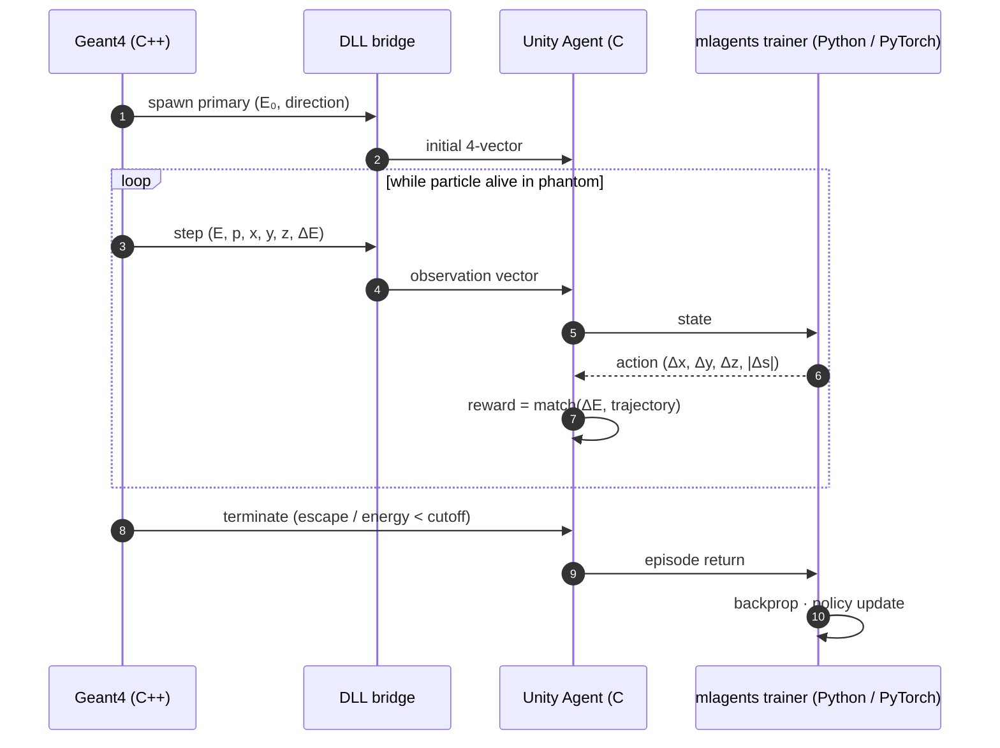

# Scalable Pipeline for Simulation Control and Data Collection<br/>Using Unity and Geant4

> **A bridge between Geant4 (Monte Carlo physics) and Unity ML Agents (Reinforcement Learning) — built so that the *physics question* (can RL learn radiation transport?) can be tackled without first building the entire infrastructure.**

<sub>Engineering thesis · Faculty of Physics and Applied Computer Science · AGH University of Science and Technology · 2025/2026</sub>
<sub>Author: **Dawid Piotrowski** ([@LeoTheOriginal](https://github.com/LeoTheOriginal))</sub>

[](https://geant4.web.cern.ch/)
[](https://github.com/Unity-Technologies/ml-agents)
[](https://www.python.org/)
[](https://isocpp.org/)
[](https://learn.microsoft.com/dotnet/csharp/)

---

## At a glance

- **Problem.** Detector design studies need millions of Monte Carlo tracks. Geant4 is the gold standard — and it's slow.
- **Idea.** Train a Reinforcement Learning agent inside Unity ML Agents to act as a **surrogate generator** that reproduces Geant4-quality tracks at a fraction of the cost.
- **Contribution of this thesis.** The **pipeline** itself: a working, low-latency bridge between Geant4 (C++) and Unity ML Agents (C# + PyTorch), validated on a toy water phantom. The physics question is the next step — that's the master's thesis.
- **Status.** Engineering thesis defended (2025/2026). Maintained as a baseline for ongoing master's-thesis work.

---

## System architecture

```mermaid
flowchart LR
    subgraph G["Geant4 — ground truth physics"]
        direction TB
        G1["Water-Phantom<br/>geometry (C++)"]
        G2["Primary generator<br/>particle gun"]
        G3["Step-by-step<br/>tracking"]
        G1 --> G2 --> G3
    end

    subgraph B["Bridge"]
        direction TB
        B1["Native Windows DLL<br/><i>in-process, low-latency</i>"]
    end

    subgraph U["Unity 3D + ML Agents"]
        direction TB
        U1["C# Agent<br/>observations &amp; rewards"]
        U2["Policy network<br/>(PyTorch via mlagents)"]
        U3["Action: next step<br/>(Δx, Δy, Δz, |Δs|)"]
        U1 --> U2 --> U3
    end

    subgraph A["Python analysis"]
        direction TB
        A1["pandas / NumPy"]
        A2["track &amp; energy metrics"]
        A3["matplotlib + TikZ<br/>→ thesis figures"]
        A1 --> A2 --> A3
    end

    G3 -- "per-step<br/>(E, p, position)" --> B1
    B1 --> U1
    U3 -. "trained policy" .-> A1
    G3 -. "reference tracks" .-> A1

    classDef g fill:#0d3b66,stroke:#0d3b66,color:#fff;
    classDef b fill:#7d4f50,stroke:#7d4f50,color:#fff;
    classDef u fill:#222,stroke:#222,color:#fff;
    classDef a fill:#1f5f3f,stroke:#1f5f3f,color:#fff;
    class G1,G2,G3 g;
    class B1 b;
    class U1,U2,U3 u;
    class A1,A2,A3 a;
```



The choice of a **native DLL bridge** (rather than gRPC + Protobuf, also evaluated during the project) keeps inter-process overhead in the µs range, which matters when an episode can produce thousands of physics steps per particle.

---

## Training loop (per particle)



Key insight from this iteration: **on-the-fly streaming** (no buffering to disk) was a *dream-scenario* assumption at the start, and turned out to work — the design was ready to fall back to a buffered dataset if the realtime pipeline couldn't keep up. It does, comfortably.

---

## Repository structure

```
.
├── geant4/
│   └── Water-Phantom/        # Geant4 application: cubic water volume,
│                             # primary particle gun, per-step instrumentation
│                             # exposing (E, p, x) over the bridge
│
├── unity/
│   └── GeantML_Test/         # Unity project + ML Agents integration
│                             # (C# Agent, observation parser, training scenes)
│
├── python/
│   ├── data/                 # processed datasets and exports
│   ├── metrics/              # evaluation metrics (track length, energy deposit, …)
│   └── figures/              # plots + TikZ for the thesis report
│
├── environment.yaml          # conda env (mlagents + scientific Python stack)
└── .gitignore                # excludes Unity Library/Temp/Build, Geant4 build/,
                              # IDE clutter, large regenerable datasets
```

Anything tracked in git is **reproducible from simulation**. Large regenerable artefacts (raw point clouds, density textures, intermediate `*.csv` event dumps, ROOT/HDF5 shared data) are kept out by design.

---

## Tech stack

| Layer | Technology | Role |
|---|---|---|
| Physics | [**Geant4**](https://geant4.web.cern.ch/) (C++) | Ground-truth radiation transport |
| Build | CMake | Geant4 application build |
| Environment | [**Unity 3D**](https://unity.com/) + [**ML Agents**](https://github.com/Unity-Technologies/ml-agents) | RL world + framework |
| Agent code | C# (Unity scripts) | Observation parsing, reward shaping |
| ML backend | [**PyTorch**](https://pytorch.org/) (via `mlagents`) | Policy network training |
| Bridge | Native **DLL** (Windows) | Geant4 ↔ Unity inter-process |
| Analysis | Python (pandas, NumPy, matplotlib) | Metrics, plots |
| Reporting | TikZ figure export (`*.tex`) | Direct inclusion in LaTeX thesis |

---

## Build & run

```bash
# 1. Conda environment — Python, PyTorch, mlagents, analysis stack
conda env create -f environment.yaml
conda activate ml-agents

# 2. Geant4 — build the Water-Phantom application
cd geant4/Water-Phantom
mkdir build && cd build
cmake .. && cmake --build . --config Release

# 3. Unity — open unity/GeantML_Test in Unity Hub (matching ML Agents version)
#    Run training from the included scene; the DLL bridge wires Geant4 → Agent automatically.
```

Tested on **Windows**. The DLL bridge is Windows-specific in this iteration — Linux / Docker portability is being explored in follow-up work.

---

## Geant4 vs RL surrogate — the trade space

| | Geant4 (ground truth) | RL surrogate *(this thesis is the baseline)* |
|---|---|---|
| Per-track latency | ~ms | (target) ~µs |
| Physics fidelity | full Bethe-Bloch + multiple scattering + secondaries | learned approximation, single-particle regime |
| Determinism | stochastic Monte Carlo | deterministic policy + ε-exploration |
| Geometry coupling | tight (CAD ↔ Geant4) | loose (agent learns per geometry) |
| Use case | validation, calibration | high-throughput detector efficiency studies |

---

## Status & what's next

- ✅ **Engineering thesis** — defended, full pipeline functional on Windows for the water-phantom toy detector.
- 🟢 **Follow-up work** (in progress): porting to **Linux + Docker**, evaluating **gRPC / TCP / ZeroMQ** transports against the DLL baseline, extending to **richer detector geometries** (muon chamber, LArTPC candidate), and tackling the **fixed-timestep mismatch** between Unity and Geant4.

---

## License & use

Private repository — all rights reserved (academic work, AGH UST). For collaboration or citation, please contact the author.
