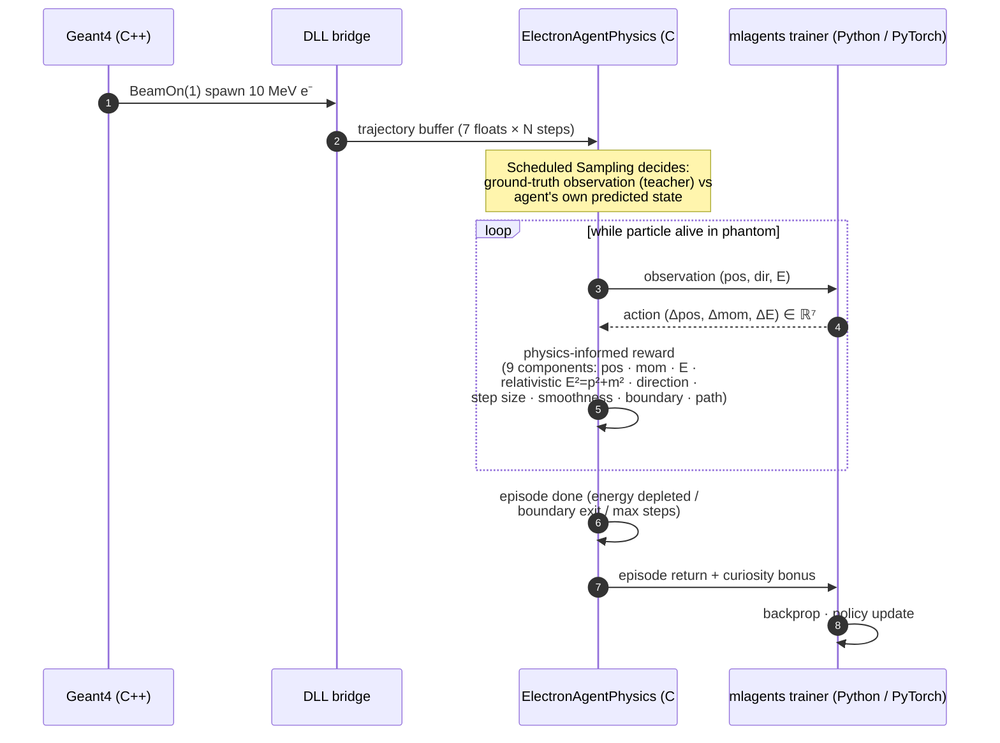

# Scalable Pipeline for Simulation Control and Data Collection<br/>Using Unity and Geant4

> **A bridge between Geant4 (Monte Carlo physics) and Unity ML Agents (Reinforcement Learning) — built so that the *physics question* (can RL learn radiation transport?) can be tackled without first building the entire infrastructure.**

<sub>Engineering thesis · Faculty of Physics and Applied Computer Science · AGH University of Science and Technology · 2025/2026</sub>
<sub>Author: **Dawid Piotrowski** ([@LeoTheOriginal](https://github.com/LeoTheOriginal))</sub>

[](https://geant4.web.cern.ch/)
[](https://github.com/Unity-Technologies/ml-agents)
[](https://pytorch.org/)
[](https://isocpp.org/)
[](https://learn.microsoft.com/dotnet/csharp/)

---

## At a glance

- **Problem.** Detector design studies need millions of Monte Carlo tracks. Geant4 is the gold standard — and it's slow.
- **Idea.** Train a Reinforcement Learning agent inside Unity ML Agents to act as a **surrogate generator** that reproduces Geant4-quality electron tracks at a fraction of the cost.
- **Contribution of this thesis.** A working **pipeline**: a low-latency native bridge between Geant4 (C++) and Unity ML Agents (C# + PyTorch), a physics-informed RL agent (`ElectronAgentPhysics`), and a comparison harness for three RL algorithms (PPO, PPO+LSTM, SAC). Validated on a toy water phantom.
- Maintained as a baseline for ongoing master's-thesis work.

---

## Concrete setup (what's actually simulated)

| | Value |
|---|---|
| Phantom | **10 × 10 × 10 cm³** water box (NIST `G4_WATER`), centred at origin in a 30³ cm³ air world |
| Primary | **Single electron**, **10 MeV** kinetic energy, perpendicular incidence at `(−6, 0, 0)` cm |
| Geant4 physics list | `G4EmLivermorePolarizedPhysics` (precise low-energy EM) with default 1 mm production cut |
| Per-step record | `position`, `momentum`, `kineticEnergy`, `energyDeposited`, `scatterAngle`, `processName` |
| Wire format | **7 floats per step** — `[x, y, z, px, py, pz, E_kin]` in cm / MeV |

---

## System architecture

```mermaid
flowchart LR
    subgraph G["Geant4 — ground truth physics"]
        direction TB
        G1["Water-Phantom<br/>10×10×10 cm³ (C++)"]
        G2["Particle gun:<br/>10 MeV e⁻ at (−6,0,0)"]
        G3["G4EmLivermorePolarizedPhysics<br/>step-by-step tracking"]
        G1 --> G2 --> G3
    end

    subgraph B["Native Bridge (geant4_plugin.dll)"]
        direction TB
        B1["11 exported C functions:<br/>InitGeant4 · RunSimulationBatch<br/>RunBatchSimulation · GetBatchStatistics<br/>GetBatchTrajectoryData · GetLateralDistribution<br/>ExportStatisticsToFile · BenchmarkGeant4Performance · …"]
    end

    subgraph U["Unity 3D + ML Agents"]
        direction TB
        U1["ElectronAgentPhysics (C#)<br/>3 modes: PhysicsBased ·<br/>Geant4Statistical · Inference"]
        U2["Observation: 7-dim<br/>(pos x,y,z · dir x,y,z · E)"]
        U3["Action: 7-dim continuous<br/>(Δpos · Δmom · ΔE)"]
        U4["Physics-informed reward<br/>(9 weighted components)"]
        U5["Policy network (PyTorch via mlagents)<br/>+ Curiosity intrinsic signal<br/>+ Scheduled Sampling / Teacher Forcing"]
        U1 --> U2 & U3
        U2 --> U5
        U3 --> U4 --> U5
    end

    subgraph A["Python analysis"]
        direction TB
        A1["pandas / NumPy<br/>+ NIST water reference data"]
        A2["track, lateral spread, energy<br/>and convergence metrics"]
        A3["matplotlib + TikZ export<br/>→ thesis figures"]
        A1 --> A2 --> A3
    end

    G3 -- "RunSimulationBatch<br/>(7 floats × N steps)" --> B1
    B1 --> U1
    U5 -. "ElectronBehavior.onnx<br/>(trained, runs without Geant4)" .-> A1
    G3 -. "reference tracks (CSV)" .-> A1

    classDef g fill:#0d3b66,stroke:#0d3b66,color:#fff;
    classDef b fill:#7d4f50,stroke:#7d4f50,color:#fff;
    classDef u fill:#222,stroke:#222,color:#fff;
    classDef a fill:#1f5f3f,stroke:#1f5f3f,color:#fff;
    class G1,G2,G3 g;
    class B1 b;
    class U1,U2,U3,U4,U5 u;
    class A1,A2,A3 a;
```



The native DLL (`geant4_plugin.dll`, called from C# via `DllImport`) was chosen over gRPC + Protobuf alternatives explored during the project — direct in-process float-buffer exchange keeps inter-process overhead in the µs range, which matters when an episode produces hundreds of physics steps per particle. A secondary **MessagePack + LZ4** path (`Core.TrajectoryBatch` in C#, the `MessagePack` and `K4os.Compression.LZ4` NuGet packages) is wired for batch loading of pre-recorded Python ground-truth datasets.

---

## Training loop (per particle)



The reward function is **physics-informed** rather than purely imitation-based: alongside per-step matching of Geant4 ground truth, it explicitly penalises trajectories that violate the relativistic energy-momentum relation `E² = p² + m²` and rewards smoothness of the angular profile.

**Scheduled Sampling / Teacher Forcing** is annealed over 10 000 episodes from full ground-truth observations down to 10 % — letting the policy gradually take over while keeping a small ground-truth signal to avoid drift.

---

## Repository structure

```
.
├── geant4/
│   └── Water-Phantom/                 # Geant4 application:
│       ├── src/Geant4Plugin.cc        #   the DLL bridge (11 C exports)
│       ├── src/SteppingAction.cc      #   per-step instrumentation
│       ├── src/PhysicsList.cc         #   G4EmLivermorePolarizedPhysics
│       ├── src/DetectorConstruction.cc#   10×10×10 cm³ water phantom
│       └── src/PrimaryGeneratorAction.cc # 10 MeV electron, +X
│
├── unity/
│   └── GeantML_Test/Assets/Scripts/
│       ├── Agents/ElectronAgentPhysics.cs  # main RL agent (V6)
│       ├── Agents/NormalDistributionRewards.cs # Gaussian-PDF reward helpers
│       ├── Core/Geant4Interface.cs    # P/Invoke into geant4_plugin.dll
│       ├── Core/Geant4Manager.cs      # Geant4 lifecycle (singleton)
│       ├── Core/DataModels.cs         # MessagePack types for batch ingest
│       ├── Visualization/             # trajectory + density visualisers
│       └── Benchmarking/              # PerformanceBenchmark.cs
│
├── python/
│   ├── data/                          # geant4 + ppo/sac trajectories,
│   │                                  # nist_water_data.txt, performance JSON
│   ├── metrics/                       # mode-collapse + JSON metric extractors
│   └── figures/                       # plotting scripts + PDF/PNG/TikZ outputs
│
├── environment.yaml                   # conda env (mlagents + scientific Python)
└── .gitignore                         # excludes Unity Library/Temp/Build,
                                       # Geant4 build/, IDE clutter,
                                       # large regenerable datasets
```

Anything tracked in git is **reproducible from simulation**. Large regenerable artefacts (raw point clouds, density textures, intermediate `*.csv` event dumps, ROOT/HDF5 shared data) are kept out by design.

---

## Tech stack

| Layer | Technology | Role |
|---|---|---|
| Physics | [**Geant4**](https://geant4.web.cern.ch/) (C++17) with `G4EmLivermorePolarizedPhysics` | Ground-truth radiation transport |
| Build | CMake | Geant4 application + DLL build |
| Bridge | Native **`geant4_plugin.dll`** (Windows, `extern "C"`, 11 exports) | Geant4 ↔ Unity inter-process |
| Secondary bridge | **MessagePack** + **K4os.Compression.LZ4** | Python-recorded ground-truth ingest |
| Environment | [**Unity 3D**](https://unity.com/) + [**ML Agents**](https://github.com/Unity-Technologies/ml-agents) | RL world + framework |
| Agent code | C# (`ElectronAgentPhysics`, three training modes) | Observations, action space, reward shaping |
| ML backend | [**PyTorch**](https://pytorch.org/) via `mlagents` trainer | Policy network training |
| Trained model | **ONNX** (`ElectronBehavior.onnx`) | Inference inside Unity, no Python needed |
| Analysis | Python (pandas, NumPy, matplotlib) | Metrics, plots, mode-collapse detection |
| Reporting | TikZ figure export (`*.tex`) | Direct inclusion in LaTeX thesis |

---

## RL algorithms compared

The same observation/action interface is trained with **three algorithms**, each in a dedicated configuration under `unity/GeantML_Test/Assets/Configs/`:

| Config | Trainer | Family | Why |
|---|---|---|---|
| `electron_ppo_v1.yaml` | **PPO** | On-policy, clipped surrogate | Stable baseline; high entropy (β = 0.15) for full angular coverage; `+ Curiosity` intrinsic signal |
| `electron_ppo_lstm_v1.yaml` | **PPO + LSTM** | On-policy + recurrent | Adds memory across the trajectory — useful when the next step depends on multi-step history (correlated scattering) |
| `electron_sac_v1.yaml` | **SAC** | Off-policy, max-entropy | Sample-efficient via 500 k replay buffer; automatic entropy tuning replaces manual β |

All three share the network shape (3 hidden layers × 256 units, normalised inputs) and are evaluated against the same Geant4 reference statistics so that algorithmic choices are isolated from environment differences.

---

## Build & run

```bash
# 1. Conda environment — Python, PyTorch, mlagents, analysis stack
conda env create -f environment.yaml
conda activate ml-agents

# 2. Geant4 — build the Water-Phantom application + the bridge DLL
cd geant4/Water-Phantom
mkdir build && cd build
cmake .. && cmake --build . --config Release
#   produces geant4_plugin.dll, picked up by Unity at runtime

# 3. Unity — open unity/GeantML_Test in Unity Hub (matching ML Agents version)
#    pick a training scene, then from a separate shell:
mlagents-learn unity/GeantML_Test/Assets/Configs/electron_ppo_v1.yaml --run-id=ppo_v1
```

Tested on **Windows**. The DLL bridge is Windows-specific in this iteration.

---

## License & use

Private repository — all rights reserved (academic work, AGH UST). For collaboration or citation, please contact the author.
